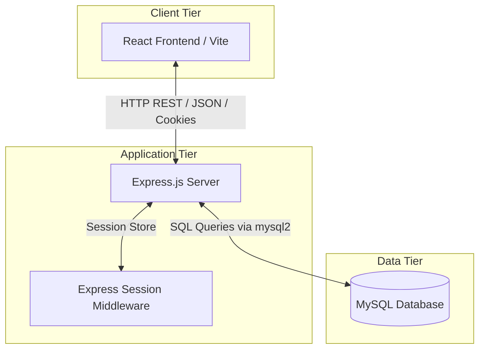

# Technical Event Management System - Project Report

This report provides an overview of the **Technical Event Management System**, detailing the technology stack, architectural design, database schema, and core features of both the frontend and backend applications.

---

## 1. Technology Stack

The project is built as a modern, decoupled web application consisting of a React-based frontend and a Node.js/Express-based backend, backed by a MySQL relational database.

### Frontend (Client-Side)
- **Framework:** [React 19](https://react.dev/) - For building a dynamic, component-based user interface.
- **Build Tool & Dev Server:** [Vite 7](https://vite.dev/) - Providing extremely fast builds and Hot Module Replacement (HMR).
- **Routing:** [React Router DOM v7](https://reactrouter.com/) - Handles client-side routing and page transitions.
- **Styling:** [Vanilla CSS](https://developer.mozilla.org/en-US/docs/Web/CSS) + [TailwindCSS v4](https://tailwindcss.com/) - Used to build a responsive, modern design with custom styling files (e.g., `OrganizerDashboard.css`, `Login.css`).
- **Icons:** [Lucide React](https://lucide.dev/) - Modern and clean icon set.
- **HTTP Client:** [Axios](https://axios-http.com/) - For making asynchronous API requests to the backend server.

### Backend (Server-Side)
- **Runtime Environment:** [Node.js](https://nodejs.org/) (using ES Modules `"type": "module"`)
- **Web Framework:** [Express.js v5](https://expressjs.com/) - To handle routing, HTTP requests, and responses.
- **Session Management:** [express-session](https://www.npmjs.com/package/express-session) - For maintaining stateful login sessions (cookies) for both general users and organizers.
- **CORS handling:** [cors](https://www.npmjs.com/package/cors) - Enabled to allow cross-origin resource sharing between the frontend (`http://localhost:5173`) and the backend (`http://localhost:5000`).
- **Body Parsing:** [body-parser](https://www.npmjs.com/package/body-parser) - Parses incoming JSON request bodies.

### Database (Data Tier)
- **Database Management System:** [MySQL](https://www.mysql.com/) (accessed via the `mysql2` driver)
- **Database Name:** `myprojectdb`

---

## 2. System Architecture

The application follows a classic **3-Tier Architecture**:



---

## 3. Database Schema

Based on the backend database queries, the database `myprojectdb` contains the following tables:

### 1. `users` (Participants)
Stores accounts for general users who register for events.
- `id` (Primary Key): Unique user ID.
- `fullname`: Participant's full name.
- `email`: Participant's email address (used for login).
- `password`: Account password.
- `phone`: Participant's contact number.

### 2. `organizer`
Stores accounts for organizers who manage events.
- `organizer_id` (Primary Key): Unique organizer ID.
- `name`: Organizer's name.
- `email`: Organizer's email address (used for login).
- `password`: Account password.
- `department`: Organizer's academic or corporate department.

### 3. `events`
Stores information about the technical events.
- `event_id` (Primary Key): Unique event ID.
- `event_name`: Title of the technical event.
- `description`: Description of the event.
- `date`: Event date.
- `time`: Event timing.
- `location`: Venue or online link.
- `organizer_id` (Foreign Key): References `organizer.organizer_id`.

### 4. `registrations`
Stores registrations of participants for specific events.
- `id` (Primary Key): Unique registration ID.
- `user_id` (Foreign Key): References `users.id`.
- `fullname`: Participant's name for the event.
- `email`: Participant's email for the event.
- `phone`: Participant's phone number for the event.
- `event_name`: Name of the registered event.
- `created_at`: Registration timestamp.

---

## 4. Core Features

### For Participants (General Users)
1. **Account Registration:** Sign up with name, email, password, and phone number (handled by `/api/signup`).
2. **Authentication:** Secure login session (handled by `/api/login`).
3. **Event Browsing:** View available technical events (`/events`).
4. **Event Registration:** Register for a specific event. The user's ID is automatically linked via session cookies (`/api/register`).
5. **Dashboard:** View all events they have registered for, including registration details and timestamps (`/participant/dashboard`).

### For Organizers
1. **Authentication:** Separate login portal (`/api/organizer/login`).
2. **Dashboard Summary:** View key metrics:
   - Total events organized by them.
   - Total participant registrations.
   - Number of upcoming vs. completed events.
3. **Event Management (CRUD):**
   - **Create:** Add new events with detailed information (`/api/organizer/add-event`).
   - **Read:** View all events or only events created by the logged-in organizer (`/api/organizer/my-events`).
   - **Update:** Edit existing event details (`/api/organizer/update-event/:id`).
   - **Delete:** Remove events (`/api/organizer/delete-event/:id`).
4. **Registrations Monitoring:** View a list of all participants who registered for events (`/api/organizer/registrations`).

---

## 5. Directory Structure

```text
DBMS_PROJECT/
├── backend/
│   ├── db.js                   # MySQL Connection configuration
│   ├── server.js               # Main Express application entry point
│   ├── middleware/             # Authentication & authorization middlewares
│   ├── routes/
│   │   ├── auth.js             # Participant login route
│   │   ├── signup.js           # Participant registration route
│   │   ├── register.js         # Event registration route
│   │   ├── organizer.js        # Organizer login, dashboard, and event CRUD routes
│   │   └── participant.js      # Participant dashboard data retrieval
│   └── package.json            # Backend Node.js dependencies
│
└── frontend/
    └── myapp/
        ├── index.html          # HTML Entry point
        ├── vite.config.js      # Vite configuration
        ├── package.json        # Frontend React dependencies
        └── src/
            ├── main.jsx        # App mounting and Client-side Routing (React Router)
            ├── App.jsx         # Create Account / Signup page
            ├── index.css       # Global styles (including TailwindCSS setup)
            ├── components/     # Reusable UI elements (Navbars, Sidebar)
            └── pages/          # Page components (Events, Dashboard, Login, etc.)
```
